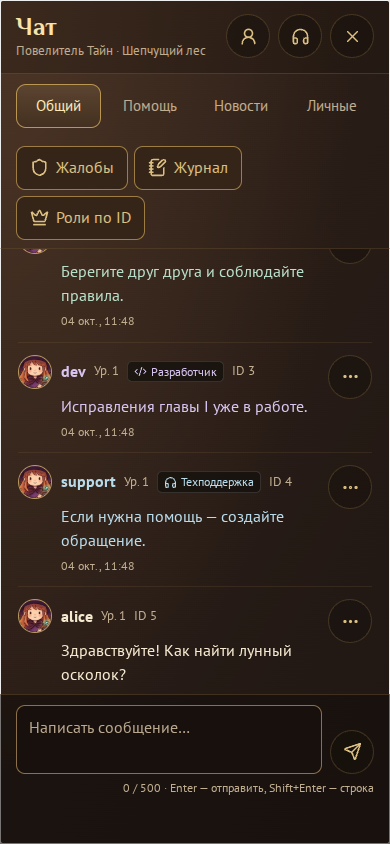
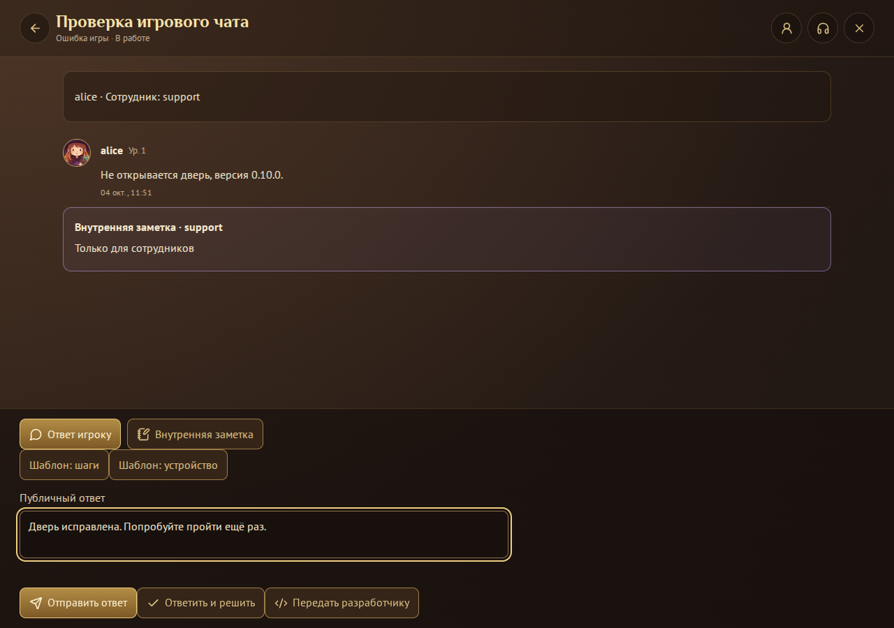

# Игровой чат

Чат подключён к пункту игрового меню, к существующей сессии Supabase и к серверному прогрессу v0.10.0. В браузере нет демонстрационных пользователей или локальных «банов». Если миграция не установлена, игрок видит сообщение о недоступности, повтор подключения и кнопку закрытия.

## Включение на сервере

1. В SQL Editor Supabase выполнить актуальный `supabase/schema.sql`, затем **целиком** `supabase/migrations/20261004_game_chat.sql`. Оба файла можно применять повторно. Существующие персонажи, инвентарь, никнеймы и прогресс сохраняются.
2. После установки базы опубликовать клиент этой ветки, войти своим аккаунтом и посмотреть собственный числовой ID в профиле. Владелец назначается **один раз через доверенный SQL Editor**, а не из браузера и не по никнейму:

```sql
-- Заменить 123 своим ID. SELECT ниже позволяет проверить выбранный профиль до назначения.
select player_id, nickname from public.profiles where player_id = 123;
insert into game_chat.roles(user_id, roles)
select id, array['owner']::text[] from public.profiles where player_id = 123
on conflict(user_id) do update set roles = excluded.roles, revision = game_chat.roles.revision + 1;
```

3. Другим администраторам роль выдаёт владелец в SQL Editor по проверенному ID:

```sql
insert into game_chat.roles(user_id, roles)
select id, array['admin']::text[] from public.profiles where player_id = 456
on conflict(user_id) do update set roles = excluded.roles, revision = game_chat.roles.revision + 1;
```

4. Модераторов, разработчиков и поддержку администратор назначает в игре: «Чат → Роли по ID → Найти → Причина → Было / станет → Подтвердить».
5. Существующих публичных переменных `VITE_SUPABASE_URL` и `VITE_SUPABASE_ANON_KEY` достаточно; дополнительные ключи в браузер не нужны. Числовой ID собственного аккаунта доступен и до назначения служебной роли.

Миграция устанавливает проверки игровой блокировки на `get_player`, `create_player`, `reset_player`, `sync_player`, `player_action`, включая уже выданные токены. Повторная установка основной схемы сохраняет эти проверки. Обжалование и поддержка доступны заблокированному аккаунту из стартового меню.

## Что доступно

Снимки интерфейса из браузерного прогона с тестовыми аккаунтами:





| Роль | Возможности |
|---|---|
| Игрок | Общий чат, помощь, чтение новостей, личные сообщения, ответы на сообщения, свой профиль, игнор, жалобы, свои обращения |
| Модератор | Удаление обычных публичных сообщений с причиной, восстановление своих удалений за 24 часа, предупреждения, запрет писать до 24 часов, жалобы и журнал |
| Администратор | Модерация, игровые блокировки до 30 дней / бессрочно, снятие ограничений, закрепления и новости, назначения трёх служебных ролей по ID, очередь и назначение поддержки |
| Разработчик | Новости и назначенные технические задачи; самостоятельных прав модерации нет |
| Поддержка | Очередь, взять свободное обращение, публичные ответы, отдельные внутренние заметки, шаблоны и передача разработчику; самостоятельных прав банить и удалять нет |
| Владелец | Права администрации; защищён от изменений в игровом интерфейсе. Администраторы назначаются доверенным SQL |

Роли независимы. При нескольких ролях цвет сообщения и основная подпись выбираются в порядке: владелец → администратор → модератор → разработчик → поддержка → игрок. Цвет текста совпадает с подписью и ником. Уровень приходит из `player_progress`, имена — из `profiles`. Числовой ID постоянен, не меняется при сбросе персонажа и регистрации гостя. Другие ID получают только администратор/владелец; собственный видит сам игрок. Во всех остальных ответах сервер передаёт отдельную случайную ссылку профиля, а не номер или UUID входа.

Все экраны чата, профилей, модерации, подтверждений, ролей и поддержки занимают доступный экран. «Назад» возвращает предыдущий экран, крестик закрывает чат. Игра на паузе; клавиатура и джойстик не управляют героем во время ввода. Вступление в бой закрывает чат. Высота учитывает экранную клавиатуру и безопасные поля телефона. Шрифты с кириллицей и SVG-иконки загружаются из самой сборки.

Сообщение: до 500 символов Unicode, до трёх упоминаний, не чаще одного за три секунды / двадцати за минуту. Свой текст можно изменить в первые три минуты, удалить в первые десять. HTML отображается обычным текстом. Удаления оставляют пустую отметку, обновляют цитаты и доходят на другое устройство. История загружается по 50 сообщений, в ленте не больше 150; старые страницы доступны отдельной кнопкой. Игнор скрывает обычные сообщения и блокирует личную переписку; официальных сотрудников игнорировать нельзя.

## Работа поддержки

- Игрок создаёт обращение: аккаунт, ошибка игры, вопрос, обжалование. Тема до 100 символов, описание / ответ до 2000. Одно незакрытое обращение в категории, до трёх новых за сутки; отдельное обжалование доступно даже при исчерпании обычного лимита. Повтор сообщения игроком — не чаще 10 секунд / 20 за час.
- Сотрудник видит очередь и атомарно берёт свободное обращение. Второй сотрудник не может перехватить его старым запросом. Администратор может назначить сотрудника из списка поддержки. Очередь показывает метаданные; полная переписка открывается автору и назначенному сотруднику.
- «Ответ игроку» и «Внутренняя заметка» — разные поля, черновики и серверные таблицы. В пользовательском ответе RPC нет заметок. Шаблоны вставляют редактируемый текст, а не отправляют его.
- Публичный ответ переводит обращение в «Ждём игрока», ответ игрока — в «В работе». «Ответить и решить» записывает непустой публичный ответ и статус одной транзакцией.
- Игрок выбирает «Всё решено» или «Проблема осталась». Закрытое обращение можно вернуть в работу в течение семи дней. История остаётся доступной.
- Разработчик получает только проверенное сотрудником техническое описание. Его ответ виден поддержке; она передаёт решение игроку. Разработчик не получает всю приватную переписку, ID игрока и заметки.
- Сотрудник не завершает обжалование санкции, выданной им самим. Снятие ограничения требует отдельной роли модератора/администратора.

## Безопасность и обмен данными

Единственный браузерный RPC: `chat_request(op, args, request_id)`. Auth берётся из действующей `PlayerSession`; свои хранилища токенов чат не создаёт. Таблицы и вспомогательные функции находятся в закрытой схеме `game_chat`, на таблицах включён RLS без клиентских политик. Прямой доступ и стандартное право PUBLIC EXECUTE отозваны. Точка входа использует `SECURITY DEFINER`, пустой `search_path` и квалифицированные имена.

Сервер проверяет роли заново, не доверяет `user_metadata`, нику и роли из аргументов. Все изменения выполняются транзакционно. Блокировки пользователей берутся в одном порядке, затем блокируется комната / обращение. У комнаты собственный счётчик последовательности: он растёт под блокировкой строки и соответствует порядку фиксации сообщений и изменений. Bigint-номера передаются JSON-строками. Изменение ролей / сообщений / обращений требует актуальной ревизии; конфликты не затирают чужую работу.

UUID запроса позволяет безопасно повторить отправку после потери ответа. Клиент повторяет тот же UUID; сервер проверяет, что аргументы не подменили. История после разрыва получает изменения, включая отметки удалённых сообщений. Жалоба сохраняет серверный снимок выбранного сообщения и максимум трёх соседних с каждой стороны в той же комнате; модератор не получает доступ ко всей личной переписке.

Для текущего клиента используется опрос RPC раз в пять секунд при открытом чате и раз в тридцать секунд для важных уведомлений при закрытом. Скрытая вкладка не делает запросов истории. В Realtime не передаётся приватный текст; подписки с устаревшими правами отсутствуют. Уведомления: личные сообщения, упоминания, новости, непрочитанные ответы поддержки. Черновики хранятся только в памяти текущего браузерного сеанса и очищаются при выходе / смене аккаунта.

## Хранение и проверки

`chat_cleanup()` доступна только серверу: общий чат 30 дней, личный 90, закрытая поддержка 90 дней после закрытия, прежние редакции 30, журнал 180. Открытые жалобы удерживают исходные сообщения; закрытые ещё 30 дней. Идемпотентные ответы хранятся семь дней. ID-счётчик не сбрасывается.

Включить `pg_cron` в Supabase и добавить ежедневную задачу (один раз):

```sql
select cron.schedule('game-chat-retention', '15 3 * * *', $$select public.chat_cleanup();$$);
```

Проверки:

```sh
npm test
npm run test:chat
npm run test:chat:browser
npm run build
```

`test:chat` использует реальный PostgreSQL-движок PGlite, а не JS-копию правил. `test:chat:browser` запускает Phaser, настоящий интерфейс и те же SQL-функции; только транспорт Auth подменён тестовыми аккаунтами. Можно задать `CHROME_PATH` и `UI_SHOTS_DIR`. Для проверки в данном окружении использован Playwright: Browser plugin недоступен. Это не проверка применённой базы Supabase или опубликованной игры; перед выпуском миграцию необходимо установить на целевой проект. PGlite выполняет тесты последовательно, поэтому отдельный нагрузочный прогон конкурентных клиентов на целевом PostgreSQL остаётся релизной проверкой.
