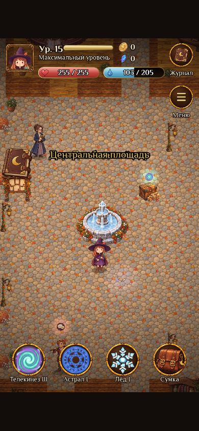
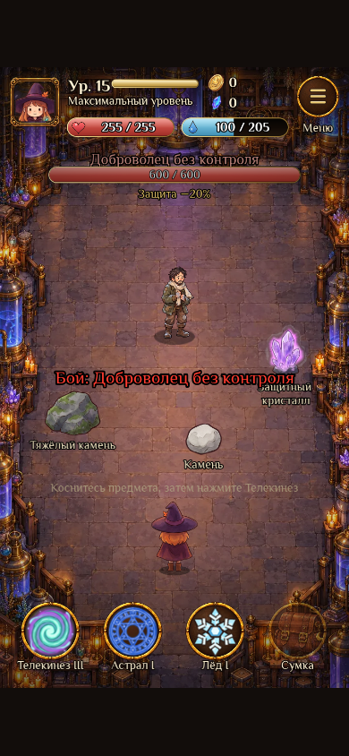

# Глава II: подключённый комплект графики

Производственная реализация согласованной [инвентаризации](chapter-2-art-inventory-v0.1.md). В `public/assets/chapter2` находятся 88 самостоятельных рисунков и 8 портретов, экспортированных в WebP. Манифест регистрирует 101 ключ текстур, включая повторное использование рисунков Северина и Тихона в бою.

## Состав

- Восемь различимых сюжетных NPC, Мирон и двое спасённых жителей.
- Пять противников города и пять противников вылазок; человеческие противники используют рисунки соответствующих людей.
- Одиннадцать предметов и зелий, отдельные документ Архива, лабораторный журнал, письма, оборудование и след на площади.
- Фасады жилых домов и складов, рынок, фонтан, фонари, доска поручений, лабораторные приборы, двери и сюжетные препятствия.
- Парные состояния: замёрзший/оттаявший дом и фонтан, вода/лёд, закрытые/открытые двери, повреждённый/стабилизированный резервуар, полные/опустошённые тайники.
- Деревья и склеп вылазок, надгробия, семь текстур земли и стен, шесть боевых фонов.

## Масштаб и карта

Люди на карте имеют высоту 118–124 мировых пикселя при высоте героя 120. В бою герой — 144 пикселя, добровольцы — 144, Северин — около 149. Высота жилого фасада — 300, складского — 240. Размеры монстров определяются типом: зверёк заметно меньше человека, страж и конструкт крупнее.

Мировые спрайты имеют опору в нижнем центре и сортируются по Y. Смена парного состояния сохраняет тот же прямоугольник изображения. Комнаты остаются открытыми разрезами в ортогональной карте; мостовая и пол являются повторяемыми текстурами. Новые жилые фасады и оборудование имеют физические основания. Двери, узкие проходы и сюжетные маршруты сохраняют существующие координаты.

`CityPresentation` добавляет кусты и цветы вдоль стен, комнатные растения, ковры, вывески, сюжетных спасённых жителей и плотные деревья внутри уже непроходимых лесных блоков. Похожие заполнители из новых зимних и кладбищенских деревьев закрывают пустые заблокированные чащи вылазок. Арт первой лесной локации и существующий HUD сохраняются.

В финале объект с прежним техническим ID `final_rift` изображён как повреждённый экспериментальный резервуар. Его ID и событие `ch2_fin_ice` сохранены для совместимости сохранений и серверной проверки. Соответствующие реплики описывают резервуар.

## Сопоставление с согласованным направлением

| Проверка | Реализация |
| --- | --- |
| Читаемость людей | Один диапазон высоты; отдельные силуэты, одежда и палитры каждого NPC |
| Соотношение домов и героя | Общий размер фасадов и видимых дверей; парные состояния не меняют размеры |
| Ортогональная карта | Отдельные спрайты с нижней опорой; открытые комнаты и существующие маршруты |
| Осенний город и холод | Тёплая мостовая, древесина и латунь; холод появляется в сюжетных слоях и состояниях |
| Наполненность | Жилые/складские фасады, лаборатория, вывески, озеленение и плотная заблокированная опушка |
| Бой | Шесть фонов с открытым центром; одинаковый масштаб людей; оттенок арены меняется в фазах Северина |

## Экспорт и проверки

`tools/art/chapter2-assets.mjs` принимает локальный JSON `{ assetId: '/absolute/path/source.png' }`, технически обрезает прозрачные поля, сохраняет пропорции и альфа-канал, экспортирует WebP и генерирует `chapter2.art.generated.js`. Флаг `--force` пересобирает весь комплект. `sources.json` содержит хеши исходников и происхождение каждого рисунка.

```sh
npm test
npm run build
npm run check:bundle
npm run test:locations
npm run test:chapter2-art
```

Браузерные проверки запускают настоящий Phaser через Playwright. `CHROME_PATH` позволяет выбрать установленный Chromium. `ART_SHOTS_DIR` задаёт каталог снимков вне репозитория. Тест проверяет диалог с портретом, замораживание воды, спасение через дверь и погреб, открытие лаборатории, оттаивание домов, вылазки, масштабы бойцов и шесть арен. Отдельные сюжетные этапы подготавливаются фикстурами; это проверка оформления и взаимодействий, а не прохождение всей главы с нуля.

## Снимки из игры

Площадь и бой с Мироном, снятые в настоящем Phaser на экране 390 × 844:




