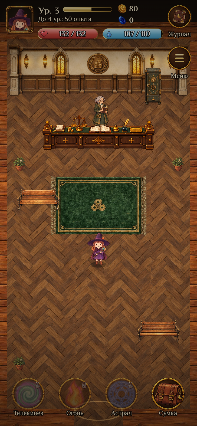
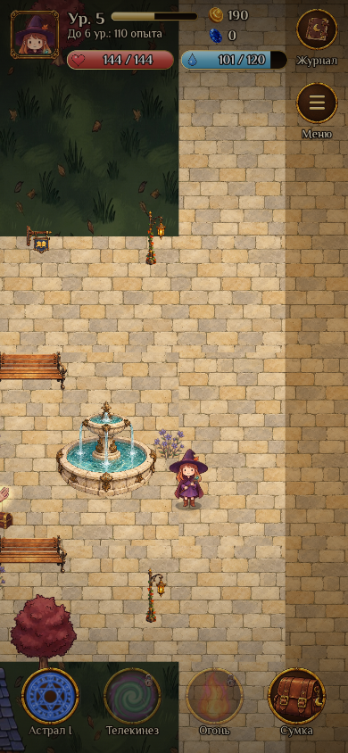

# Проверка игрового города v0.36.0

Проверены просторная планировка, мостовая, площадь, индивидуальные фасады всех 12 зданий и оформление девяти игровых помещений. Движущиеся жители, дети и кареты остаются следующим этапом. На снимках видны реальные Phaser-сцены с героиней; временные уведомления скрыты для просмотра пространства.

| Проверка | Результат |
| --- | --- |
| Все подходы к 12 фасадам и точки взаимодействия в 9 помещениях | Пройдена |
| Ледяная преграда и вода запирают север, обхода нет | Пройдена |
| Лаборатория закрыта до квеста; условия остальных входов сохранены | Пройдена |
| Оба складских входа ведут в одну комнату с прежними ID | Пройдена |
| Старые городские позиции и новый черновик редактора | Пройдена |
| Вход/выход и движение: 390×844, 320×568, 1280×900 | Пройдена |
| Перезагрузка в банке сохраняет комнату и инвентарь | Пройдена |
| Нажатие на пол строит путь внутри комнаты, 390×844 | Пройдена |
| Камера и объекты ограничены текущим помещением, 390×844 | Пройдена |
| Перезагрузка во время боя на складе сохраняет комнату и даёт ручной повтор без добычи | Пройдена |
| `npm test`, `npm run test:admin`, сборка и проверка сборки | Пройдены |
| Серверный каталог админки и сгенерированный обработчик боя | Совпадают с исходниками |
| `_game_rules()` в существующей SQL-схеме | Совпадает с новым клиентом |
| Нажатие на Агату ведёт перед стойкой и открывает разговор: 390×844, 320×568, 1280×900 | Пройдена |
| Разговор с Иларией и чтение документа на столе через Астрал: те же три экрана | Пройдена |
| Фонтан меняет новую замёрзшую графику на обычную по сюжетному событию | Пройдена |
| Коллизии скамейки и растений; ковры и мостовая остаются проходимыми | Пройдена |
| Новые спрайты и материалы: размеры, слои, прозрачность, масштаб относительно героини | Проверены визуально |

Браузерные проверки выполнялись в Playwright с локальным сохранением. Рабочая база и опубликованная игра не изменялись.

Дополнительная проверка `test:city-houses` покрывает семь остальных помещений и десять фасадов, кнопку входа/выхода, разговоры с Северином и Ровеной, Астрал для журнала и финальных писем, а также холодный оттенок новых домов и его снятие по сюжету. Снимки создаются вне репозитория в `CITY_SHOTS_DIR`. Для поздних сюжетных объектов используются согласованные локальные состояния событий и предметов. Полное прохождение второй главы с нуля этой проверкой не заявляется.

Обновлённый `test:city-rooms` ждёт подтверждённого движения вместо фиксированного удержания клавиши 200 мс, чтобы результат не зависел от частоты кадров проверочного браузера.

