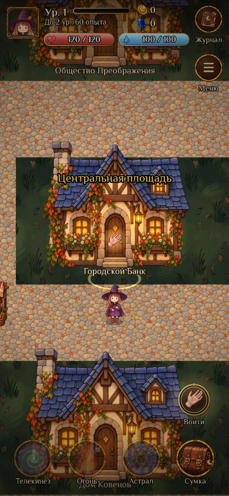
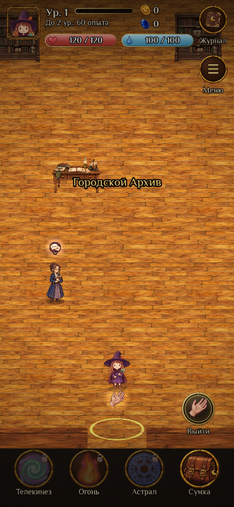

# Проверка игрового города v0.36.0

Проверена рабочая планировка на существующих изображениях. Новая архитектура из дизайн-пакета и городской трафик остаются следующим этапом. На снимках видны реальные Phaser-сцены; квестовые уведомления скрыты для просмотра пространства.

| Проверка | Результат |
| --- | --- |
| Все подходы к 12 фасадам и точки взаимодействия в 9 помещениях | Пройдена |
| Ледяная преграда и вода запирают север, обхода нет | Пройдена |
| Лаборатория закрыта до квеста; условия остальных входов сохранены | Пройдена |
| Оба складских входа ведут в одну комнату с прежними ID | Пройдена |
| Старые городские позиции и новый черновик редактора | Пройдена |
| Вход/выход и движение: 390×844, 320×568, 1280×900 | Пройдена |
| Перезагрузка в банке сохраняет комнату и инвентарь | Пройдена |
| Нажатие на пол строит путь внутри комнаты, 390×844 | Пройдена |
| Камера и объекты ограничены текущим помещением, 390×844 | Пройдена |
| Перезагрузка во время боя на складе сохраняет комнату и даёт ручной повтор без добычи | Пройдена |
| `npm test`, `npm run test:admin`, сборка и проверка сборки | Пройдены |
| Серверный каталог админки и сгенерированный обработчик боя | Совпадают с исходниками |
| `_game_rules()` в существующей SQL-схеме | Совпадает с новым клиентом |

Браузерные проверки выполнялись в Playwright с локальным сохранением. Рабочая база и опубликованная игра не изменялись.

